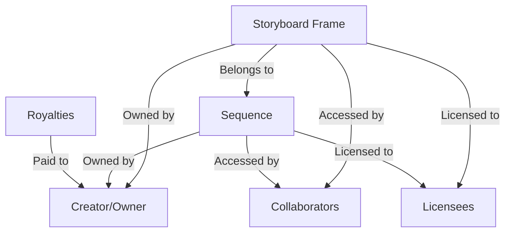

# FrameForge Storyboard Platform

A blockchain-based platform enabling filmmakers and content creators to mint, manage, and monetize their storyboards as digital assets on the Stacks blockchain.

## Overview

FrameForge transforms traditional storyboarding into a blockchain-powered digital asset management system. The platform enables:

- Minting individual storyboard frames as NFTs
- Organizing frames into sequences
- Managing collaboration between team members
- Establishing provable ownership of creative work
- Monetizing storyboards through licensing and sales
- Automated royalty distribution

## Architecture

FrameForge is built on a single smart contract that manages all core functionality through an interconnected system of data maps and functions.



### Core Components

- **Frames**: Individual storyboard images with metadata
- **Sequences**: Collections of ordered frames
- **Collaborators**: Team members with defined roles
- **Licenses**: Usage rights for frames or sequences
- **Royalties**: Automated payment distribution

## Contract Documentation

### Frame Management

#### Creating Frames
```clarity
(create-frame metadata-url scene-description camera-angle production-notes royalty-percentage)
```
Creates a new storyboard frame NFT with associated metadata and royalty settings.

#### Updating Frames
```clarity
(update-frame frame-id metadata-url scene-description camera-angle production-notes)
```
Modifies frame metadata if you have appropriate permissions.

### Sequence Management

#### Creating Sequences
```clarity
(create-sequence title description initial-frame-ids royalty-percentage)
```
Creates a new sequence containing multiple frames.

#### Adding Frames
```clarity
(add-frame-to-sequence sequence-id frame-id)
```
Adds an existing frame to a sequence.

### Collaboration System

#### Roles
- Owner (ROLE-OWNER): Full control over assets
- Editor (ROLE-EDITOR): Can modify frame/sequence content
- Viewer (ROLE-VIEWER): Can view assets

#### Adding Collaborators
```clarity
(add-collaborator asset-type asset-id collaborator role)
```
Grants specific permissions to team members.

### Licensing System

#### Creating Licenses
```clarity
(create-license asset-type asset-id licensee duration terms payment)
```
Establishes usage rights for frames or sequences.

#### Purchasing Licenses
```clarity
(purchase-license asset-type asset-id duration terms)
```
Acquires usage rights with automatic payment processing.

## Getting Started

### Prerequisites

- Clarinet
- Stacks wallet
- Node.js environment

### Installation

1. Clone the repository
2. Install dependencies
```bash
clarinet install
```
3. Deploy locally
```bash
clarinet test
```

### Basic Usage

1. Create a frame:
```clarity
(contract-call? .frameforge create-frame "https://metadata.url" "Scene 1" "Wide Shot" "Opening sequence" u500)
```

2. Create a sequence:
```clarity
(contract-call? .frameforge create-sequence "Episode 1" "Opening sequence" (list u1 u2 u3) u500)
```

## Function Reference

### Read-Only Functions

- `get-frame`: Retrieves frame details
- `get-sequence`: Retrieves sequence details
- `get-sequence-frames`: Lists frames in a sequence
- `get-collaborators`: Lists collaborators and their roles
- `has-license`: Checks license validity

### Public Functions

- Frame Management
  - `create-frame`
  - `update-frame`
  - `transfer-frame`
  - `lock-frame`

- Sequence Management
  - `create-sequence`
  - `add-frame-to-sequence`
  - `transfer-sequence`

- Collaboration
  - `add-collaborator`

- Licensing
  - `create-license`
  - `purchase-license`

## Development

### Testing

Run the test suite:
```bash
clarinet test
```

### Local Development

1. Start Clarinet console:
```bash
clarinet console
```

2. Deploy contract:
```bash
(contract-call? .frameforge ...)
```

## Security Considerations

### Permissions
- Only owners can transfer assets
- Editors cannot transfer or lock assets
- Viewers have read-only access

### Limitations
- Maximum 100 frames per sequence
- Maximum 20 collaborators per asset
- Maximum 50% royalty rate
- Locked frames cannot be modified

### Best Practices
- Always verify transaction success
- Lock important assets after finalization
- Keep private keys secure
- Review collaborator permissions regularly